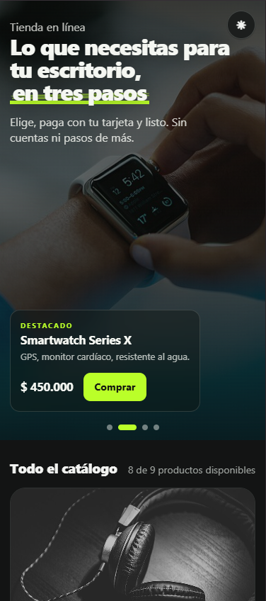
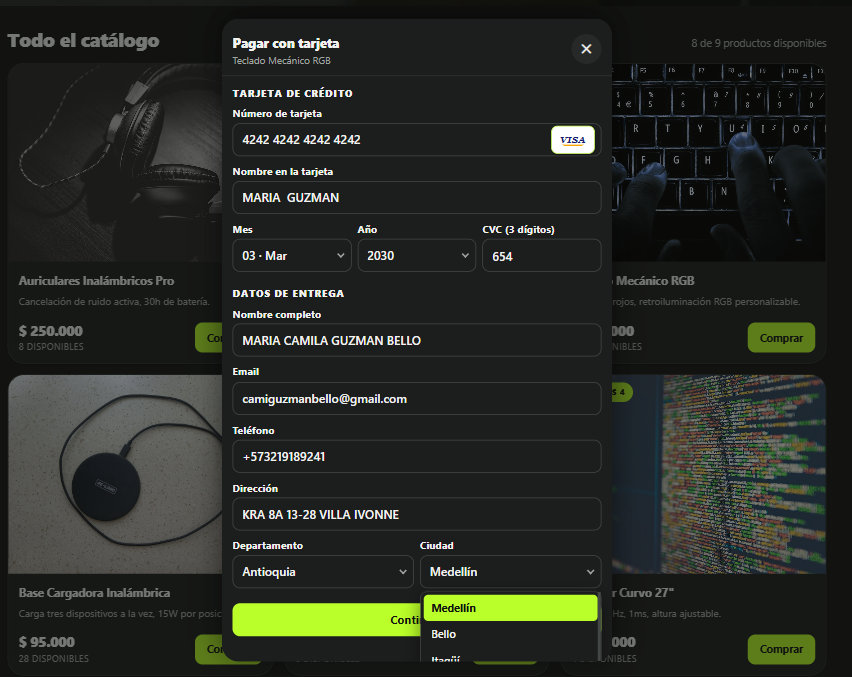
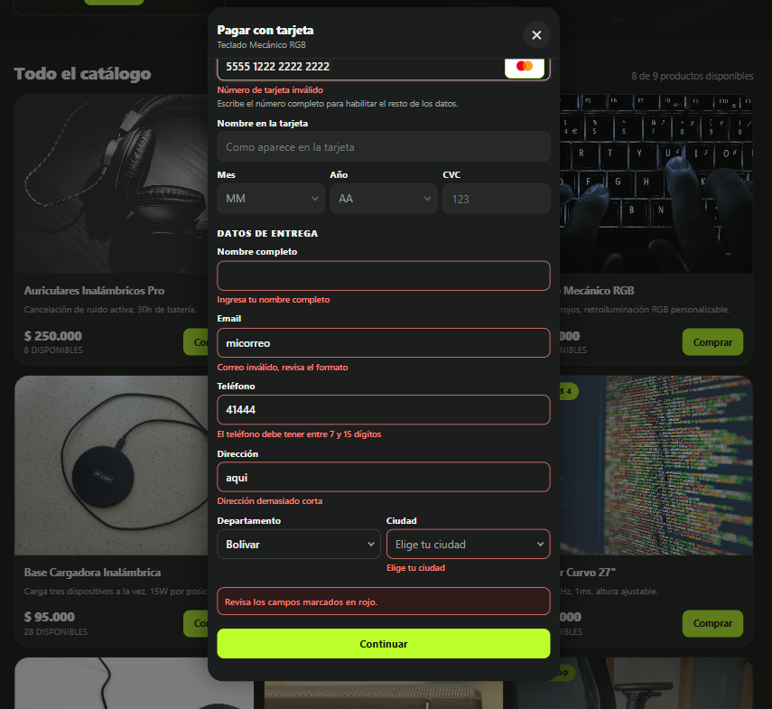
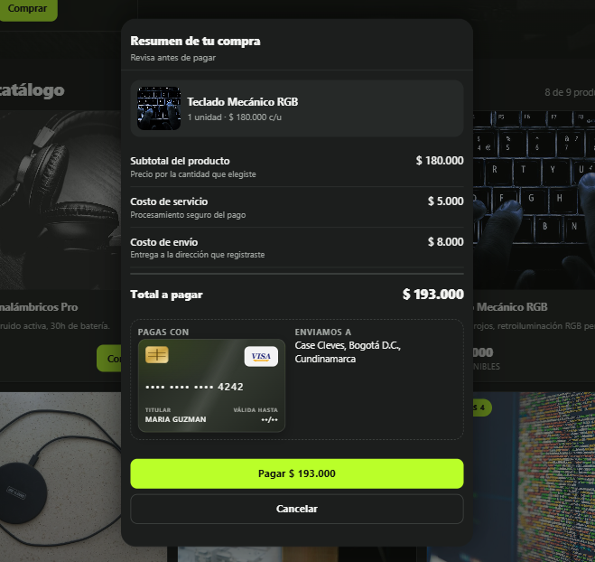
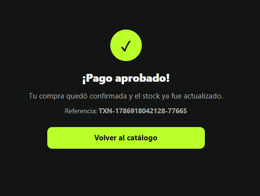
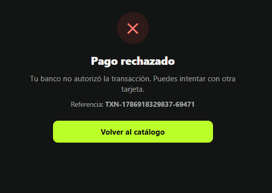
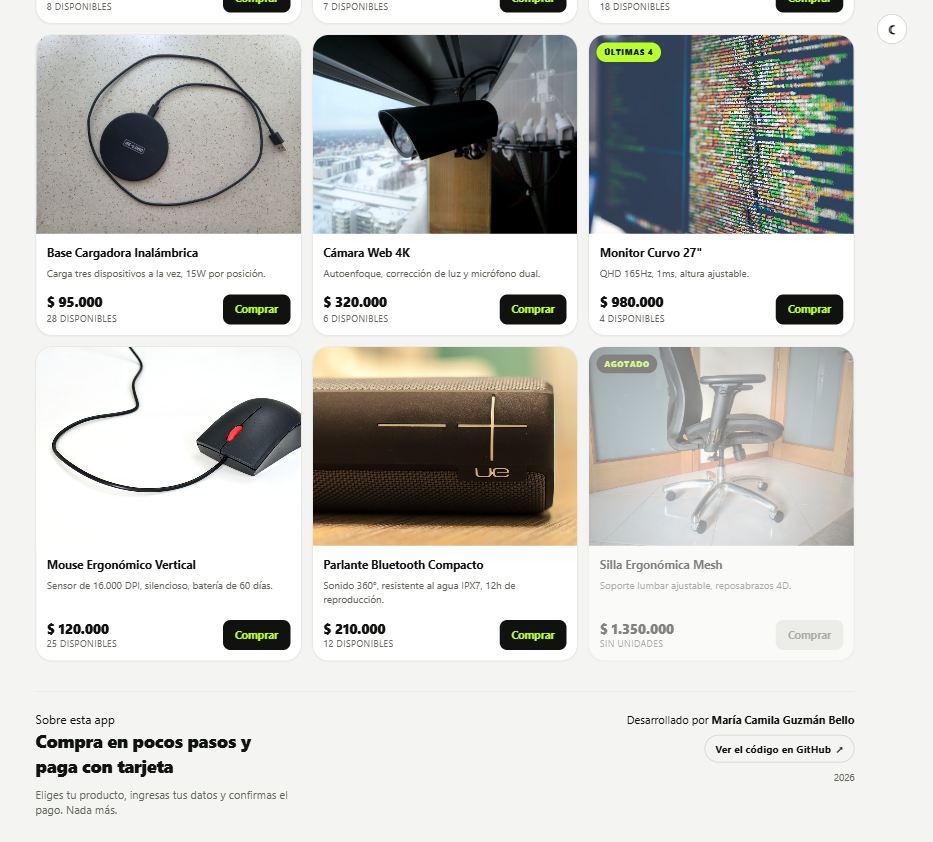
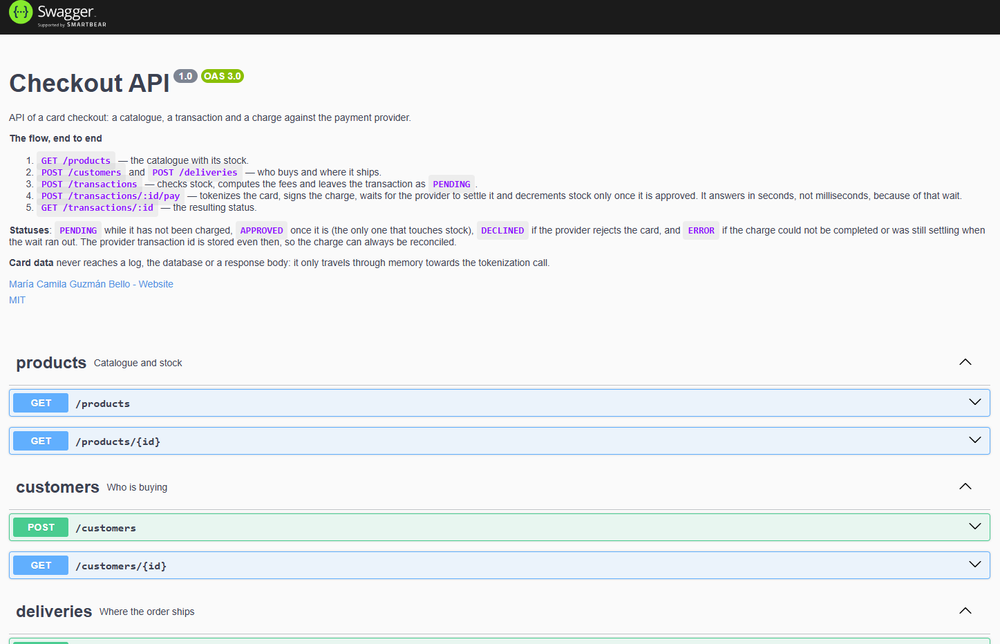

# Checkout App

Una tienda con pago real: eliges un producto, ingresas tu tarjeta y tus datos de
entrega, confirmas y el cobro se procesa contra la pasarela de pagos. El stock se
reserva antes de cobrar y se libera si el pago no prospera, así que nunca se
cobra por algo que ya no está.


---

## Enlaces

| Qué | Dónde | Estado |
| --- | --- | --- |
| Aplicación web | https://checkout-payment-app-theta.vercel.app | En producción |
| API | https://checkout-backend-k7ka.onrender.com | En producción |
| Documentación de la API (Swagger) | https://checkout-backend-k7ka.onrender.com/api-docs | En producción |
| Repositorio | https://github.com/camiguzmanbello/checkout-payment-app | Público |

> ℹ️ **La primera petición puede tardar.** El backend corre en el plan gratuito
> de Render, que suspende el servicio cuando pasa un rato sin tráfico. La
> primera petición después de esa inactividad tiene que despertar la instancia,
> así que puede demorar unos segundos extra en responder — el catálogo tarda en
> aparecer o el primer pago se siente lento. Las peticiones siguientes ya van a
> velocidad normal. Es el comportamiento propio del plan gratuito, no un fallo
> de la aplicación.

---

## Cómo se ve

### Landing

El catálogo abre con un carrusel de destacados a pantalla completa y el titular
sobre la imagen; debajo, todos los productos con su stock.


### En el teléfono

Todo está pensado mobile first: el carrusel se desliza con el dedo y el
formulario ocupa la pantalla completa, para que no se confunda con el catálogo
que quedó detrás.



### Tarjeta y entrega

Un solo formulario con validación campo por campo: la marca se detecta mientras
escribes, y el mes, el año, el departamento y la ciudad se eligen de una lista
para que no entren datos mal escritos.





### Resumen

El desglose completo antes de pagar, con la tarjeta dibujada y el monto en el
propio botón.



### Resultado





### Modo claro



### Documentación de la API



---

## El flujo, de principio a fin

1. **Producto** — catálogo con precio y stock.
2. **Tarjeta y entrega** — datos de pago y dirección, validados en el navegador
   y otra vez en el backend.
3. **Resumen** — producto, subtotal, costo de servicio, costo de envío y total.
4. **Estado final** — aprobado, rechazado o sin confirmar.
5. **Vuelta al catálogo** — con el stock ya actualizado.

### Estados de una transacción

| Estado | Qué significa |
| --- | --- |
| `PENDING` | Creada, todavía sin cobrar |
| `APPROVED` | Cobrada. El stock reservado antes del cobro se queda descontado |
| `DECLINED` | La pasarela rechazó la tarjeta |
| `ERROR` | No se pudo completar, o seguía procesándose cuando venció la espera. Se guarda el id de la pasarela para poder reconciliar |

---

## Cómo correrlo

Necesitas Node 20+, npm y Docker (para la base de datos).

### 1. Backend

```bash
cd backend
npm install
cp .env.example .env      # completa DATABASE_URL y las llaves de la pasarela
docker compose up -d      # Postgres 17 en el puerto 5433
npm run prisma:generate
npm run prisma:migrate
npm run prisma:seed
npm run start:dev         # queda en http://localhost:3000
```

### 2. Frontend

```bash
cd frontend
npm install
cp .env.example .env      # VITE_API_URL apuntando al backend
npm run dev               # queda en http://localhost:5173
```

Detalle en [`backend/README.md`](backend/README.md) y
[`frontend/README.md`](frontend/README.md).

> En producción el seed se corre con `npm run prisma:seed:prod`, no con
> `npm run prisma:seed`: este último usa `ts-node`, que no sobrevive al descarte
> de dependencias de desarrollo. La secuencia completa de despliegue está en
> [`backend/README.md`](backend/README.md#production-build).

### Probar un pago

Con las tarjetas de prueba de la pasarela, cualquier CVC y una fecha futura:

| Número | Resultado |
| --- | --- |
| `4242 4242 4242 4242` | Aprobado |
| `4111 1111 1111 1111` | Rechazado |

---

## Stack

| Capa | Tecnologías |
| --- | --- |
| Frontend | React 18, Redux Toolkit, Vite, Jest + Testing Library |
| Backend | Nest.js, Prisma, PostgreSQL, Jest |
| Infraestructura | Docker Compose para la base de datos local |

### Arquitectura

**Backend — hexagonal (puertos y adaptadores).** Cada módulo separa `domain/`
(entidades y puertos), `application/` (casos de uso) e `infrastructure/`
(controladores y adaptadores). El dominio no conoce nada de afuera, y los casos
de uso de escritura devuelven un `Result<T, E>` en vez de lanzar excepciones: el
controlador es el que traduce el fallo a un estado HTTP.

**Frontend — Flux con Redux Toolkit.** Un único slice sostiene los cinco pasos
del flujo, con thunks hacia la API. El progreso sobrevive a un refresh gracias a
localStorage, del que se excluyen a propósito los datos de tarjeta.

---

## Pruebas

```bash
cd backend  && npm run test:cov
cd frontend && npm run test:cov
```

| | Backend | Frontend |
| --- | --- | --- |
| Tests | 110 | 159 |
| Statements | 100% | 91% |
| Ramas | 95% | 87% |

Ninguna prueba toca la red ni la base de datos: la pasarela se ejercita con
`fetch` simulado y los repositorios con el cliente de Prisma simulado, así que
la suite corre en CI sin credenciales.

---

## Seguridad

- Los **datos de tarjeta** no llegan a un log, a la base de datos ni a una
  respuesta: solo pasan por memoria hacia la tokenización. El modelo
  `Transaction` no tiene un solo campo de tarjeta.
- El **número** se muestra enmascarado a sus últimos cuatro dígitos, la
  **vigencia** aparece como `••/••` y el **CVC** no se dibuja en ninguna parte.
- Las **llaves** viven en `.env`, que nunca se commitea.
- La **validación** ocurre dos veces: en el navegador para quien llena el
  formulario, y en el backend, que es lo que de verdad protege la base.
- Además: rate limiting global, cabeceras seguras con Helmet, CORS restringido a
  un origen conocido y un filtro de errores que nunca filtra trazas al cliente.

---

## Autoría

Desarrollado por **María Camila Guzmán Bello** — 2026.
Licencia [MIT](LICENSE).
